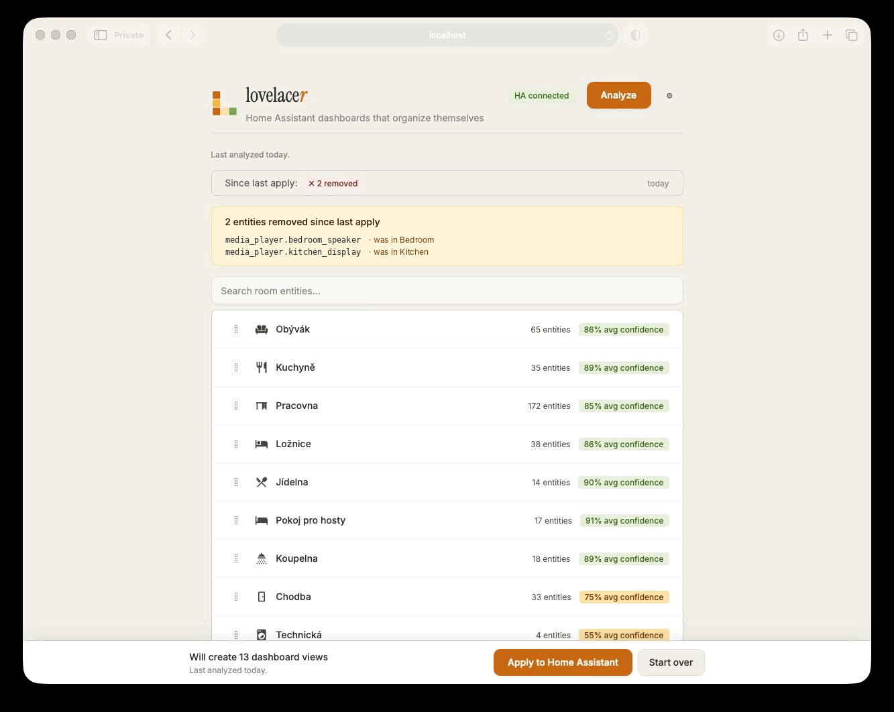
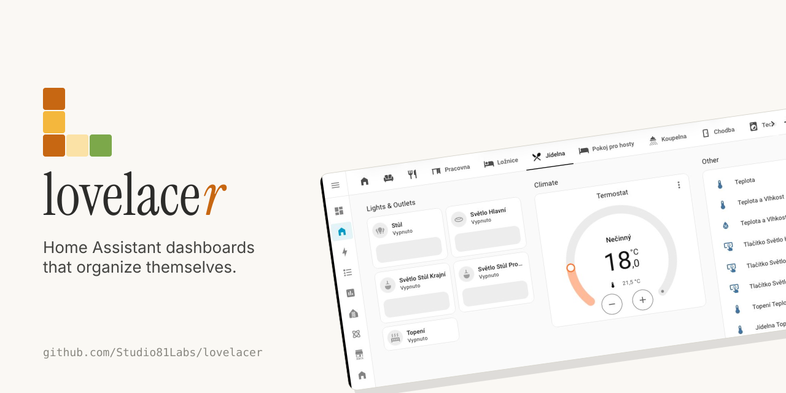
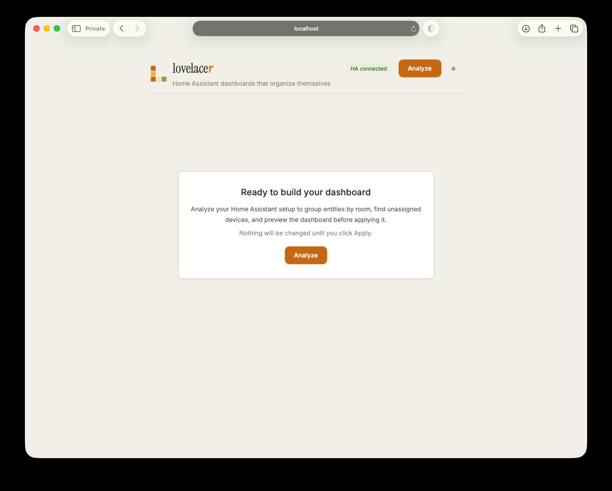
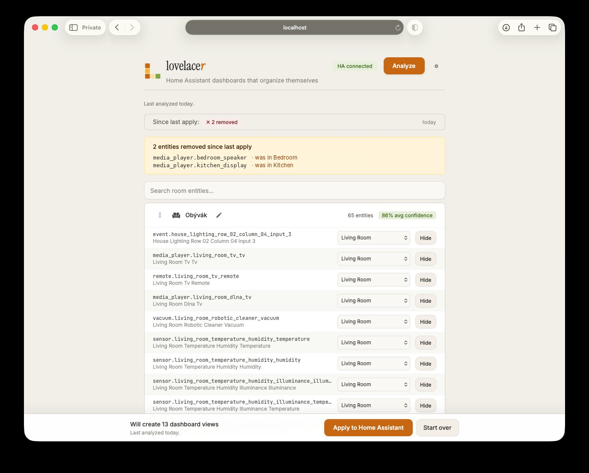
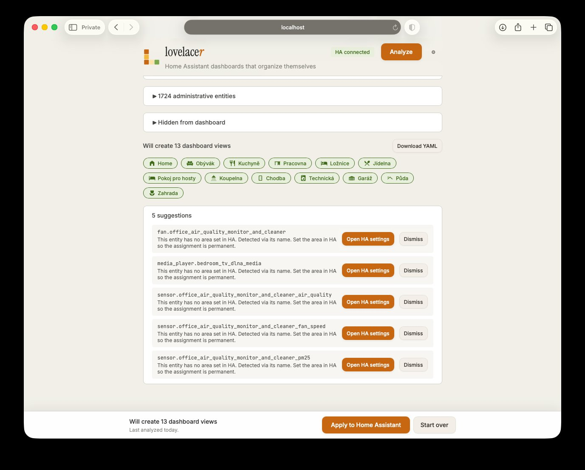
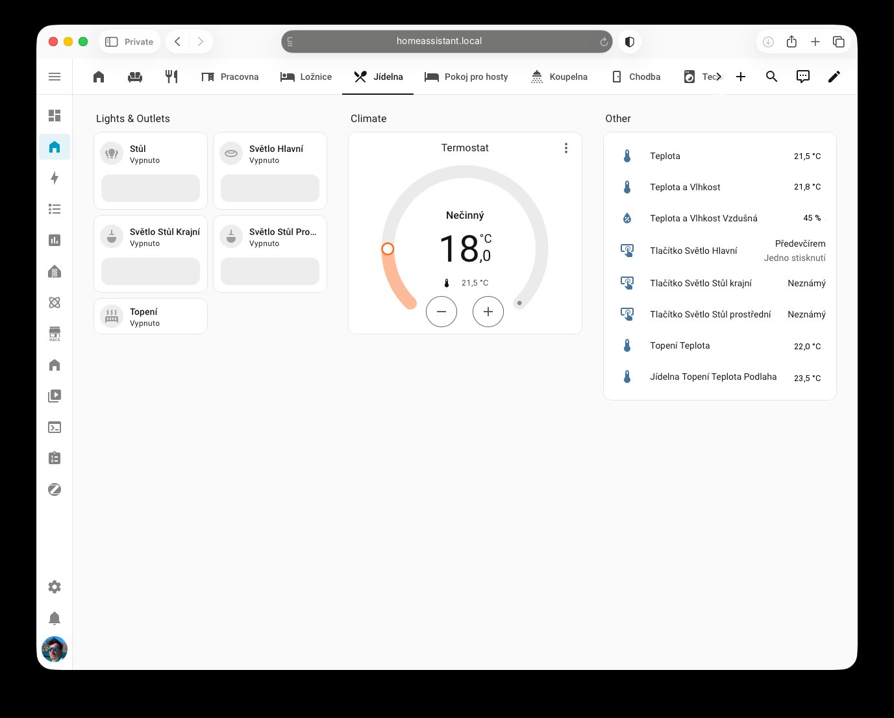

<p align="center">
  
</p>

<p align="center">
  <em>Home Assistant dashboards that organize themselves.</em>
</p>

<p align="center">
  Point Lovelacer at your Home Assistant install and get a clean starting dashboard you can actually use — in under five minutes, without writing YAML.
</p>

<p align="center">
  
  
  <a href="https://github.com/Studio81Labs/lovelacer/actions/workflows/ci.yml"></a>
</p>

---

<p align="center">
  
</p>

<p align="center"><sub>From zero to a working dashboard in under a minute.</sub></p>

## Why this exists

Home Assistant is the most flexible smart home platform on the market and also the one most likely to leave a new user staring at a wall of `sensor.0x00158d000123abcd_battery` entities with no idea where to start. The official UI auto-generates a dashboard, but it's notoriously bad: every entity dumped into a single view, no grouping, no per-room structure, no opinion. The community workaround is to spend a weekend learning Lovelace YAML, custom cards, and the area/device data model.

Lovelacer does that weekend's work in five minutes — read the entity registry, infer rooms, group sensibly, generate a real dashboard, preview before applying.

## What you get

|                                                                                                        |                                                                                                |
| :----------------------------------------------------------------------------------------------------: | :--------------------------------------------------------------------------------------------: |
|  |  |
|              The main view after Analyze. Confidence pills, dashboard preview, apply bar.              |                  The first-run wizard. Pick a language; the rest auto-fills.                   |
|          |                         |
|                   Re-analyze after you add devices. The diff view shows what moved.                    |                     Smart suggestions. Accept improvements with one click.                     |

<p align="center">
  
</p>

<p align="center"><sub>The result. A native HA dashboard. No custom cards required.</sub></p>

## Quick start

1. In Home Assistant, open **Settings → Add-ons → ⋮ → Repositories**, paste `https://github.com/Studio81Labs/lovelacer`, and click **Add**.
2. Find the **Lovelacer** card in the add-on store, click **Install**, then **Start**.
3. Click **Open Web UI** and follow the wizard.

Full instructions and troubleshooting: [`docs/ADDON_INSTALL.md`](./docs/ADDON_INSTALL.md).

## Architecture at a glance

```
┌─────────────────────────────────────────────────────────────┐
│                    Home Assistant Core                       │
│  ┌──────────┐  ┌────────────┐  ┌────────────────────────┐  │
│  │ Entities │  │   Areas    │  │  Lovelace Storage API  │  │
│  └────┬─────┘  └──────┬─────┘  └───────────┬────────────┘  │
└───────┼───────────────┼────────────────────┼───────────────┘
        │ WebSocket API │                    │ WS lovelace/*
        ▼               ▼                    ▲
┌─────────────────────────────────────────────────────────────┐
│              Lovelacer Add-on (Docker)                       │
│  ┌──────────────┐  ┌──────────────┐  ┌─────────────────┐   │
│  │ HA Client    │→ │ Analyzer +   │→ │ Generator       │   │
│  │ (ws + rest)  │  │ Heuristics   │  │ (storage/YAML)  │   │
│  └──────────────┘  └──────┬───────┘  └────────┬────────┘   │
│                           ▼                   ▼             │
│                    ┌─────────────────────────────────┐      │
│                    │  Fastify API + SQLite (state)   │      │
│                    └────────────────┬────────────────┘      │
└─────────────────────────────────────┼────────────────────────┘
                                      │ HTTP
                                      ▼
                              ┌──────────────┐
                              │ Vue 3 SPA    │
                              │ (Preview UI) │
                              └──────────────┘
```

Full breakdown in [`docs/ARCHITECTURE.md`](./docs/ARCHITECTURE.md).

## Documents

| File                                                             | Purpose                                                                                   |
| ---------------------------------------------------------------- | ----------------------------------------------------------------------------------------- |
| [`docs/PRD.md`](./docs/PRD.md)                                   | Personas, problem, scope, competitive landscape, three-tier monetization, success metrics |
| [`docs/ARCHITECTURE.md`](./docs/ARCHITECTURE.md)                 | Tech stack, components, storage-mode-vs-YAML-mode decision, HA integration                |
| [`docs/HEURISTICS.md`](./docs/HEURISTICS.md)                     | Room detection chain, multi-language matching, confidence scoring                         |
| [`docs/DASHBOARD_GENERATION.md`](./docs/DASHBOARD_GENERATION.md) | View layout, per-domain card mapping, example outputs                                     |
| [`docs/AI_FEATURES.md`](./docs/AI_FEATURES.md)                   | Tier 2 / Tier 3 AI design, LLM provider abstraction, privacy boundaries                   |
| [`docs/SMART_PANEL_BRIDGE.md`](./docs/SMART_PANEL_BRIDGE.md)     | Design note for the FastyBird Smart Panel export target                                   |
| [`docs/BRAND.md`](./docs/BRAND.md)                               | Visual identity — palette, typography, logo usage, voice                                  |
| [`docs/ADDON_INSTALL.md`](./docs/ADDON_INSTALL.md)               | HA add-on installation walkthrough + troubleshooting                                      |
| [`docs/ROADMAP.md`](./docs/ROADMAP.md)                           | Phased plan with real tickets and acceptance criteria                                     |

## Project facts

- **Name:** Lovelacer. Wordmark sets the trailing **r** in italic amber. A portmanteau of Lovelace and the agentive _-r_ suffix.
- **Distribution:** Home Assistant Add-on (Supervisor-managed) as the primary channel, standalone Docker as a secondary one.
- **Apply mode:** Lovelace **storage mode** by default (writes via WebSocket), with YAML export as a feature.
- **Stack:** Node.js + Fastify backend, Vue 3 + Vite frontend, SQLite for local state.
- **Room detection i18n:** User-selectable detection languages are Auto, EN, and CS. Auto matches every shipped keyword pack today (EN, CS, DE); ES, FR, IT, PL, and NL are reserved in the analyzer type contract for future keyword packs.
- **UI i18n:** UI ships in English, Czech, and German (independent of room-detection language). German is alpha-quality; translation PRs welcome.
- **License:** MIT. AI features are part of the same code base; using them requires runtime configuration of an LLM provider.
- **Visual identity:** Honey amber primary, warm stone neutrals, forest green accent. Instrument Serif (display) + Inter (UI) + JetBrains Mono (code). See [`docs/BRAND.md`](./docs/BRAND.md).

## Roadmap

Phase 2 (alpha-ready) ships now. Phase 3 starts after public-alpha feedback. See [`docs/ROADMAP.md`](./docs/ROADMAP.md) for the full plan.

## License

MIT. See [`LICENSE`](./LICENSE).
