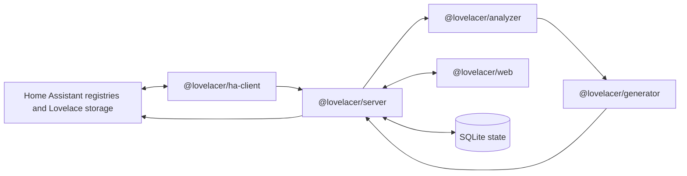

# Architecture

Lovelacer is a pnpm workspace monorepo. It ships as a Home Assistant add-on and as a standalone Node runtime for development or Docker users.

## Package map

| Package                | Responsibility                                                                                                  |
| ---------------------- | --------------------------------------------------------------------------------------------------------------- |
| `apps/addon`           | Home Assistant add-on metadata, Dockerfile, S6 run script, and release packaging.                               |
| `@lovelacer/server`    | Fastify API, static web serving, SQLite state, and orchestration of analysis, preview, apply, and export flows. |
| `@lovelacer/web`       | Vue 3 and Vite single-page app for onboarding, analysis review, preview, settings, and apply actions.           |
| `@lovelacer/ha-client` | Home Assistant WebSocket and REST access. Other packages should not make ad-hoc Home Assistant calls.           |
| `@lovelacer/analyzer`  | Pure entity, room, floor, and suggestion analysis. No I/O.                                                      |
| `@lovelacer/generator` | Deterministic Lovelace dashboard config and YAML export generation.                                             |
| `@lovelacer/shared`    | Shared types, constants, fixtures, and validation helpers.                                                      |

## Data flow

1. The server asks `@lovelacer/ha-client` for Home Assistant entity, device, area, floor, and dashboard data.
2. The analyzer normalizes entities, detects rooms, scores confidence, groups by domain, and produces suggestions.
3. The generator turns analyzed rooms into a Lovelace storage config or YAML export.
4. The web UI previews the result and lets the user apply it.
5. The server writes through Home Assistant Lovelace storage APIs and stores local preferences, overrides, dismissed suggestions, and previous analysis runs in SQLite.

## Runtime modes

| Mode              | Auth                     | URL shape              | Notes                                                      |
| ----------------- | ------------------------ | ---------------------- | ---------------------------------------------------------- |
| Add-on            | `SUPERVISOR_TOKEN`       | Home Assistant ingress | Primary distribution path. No user token setup.            |
| Standalone Docker | `HA_URL` plus `HA_TOKEN` | Direct HTTP port       | Secondary path for HA Core, HA Container, and development. |

Both paths use the same server, analyzer, generator, and web packages. Keep changes compatible with both unless a feature explicitly targets one runtime.

## Dashboard apply strategy

Lovelacer defaults to Home Assistant Lovelace storage mode. It creates or updates a separate dashboard, usually at `lovelacer-home`, instead of overwriting the user's default dashboard.

YAML export is still available for users who want to review, version, or hand-edit the generated config.

## Optional AI layer

AI features are optional and off by default. Any model-backed path must honor the configured `AI_ENABLED` flag, confidence threshold, and per-run cost or call caps. The heuristic pipeline remains the default and must continue to work without provider keys.
